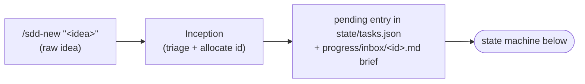
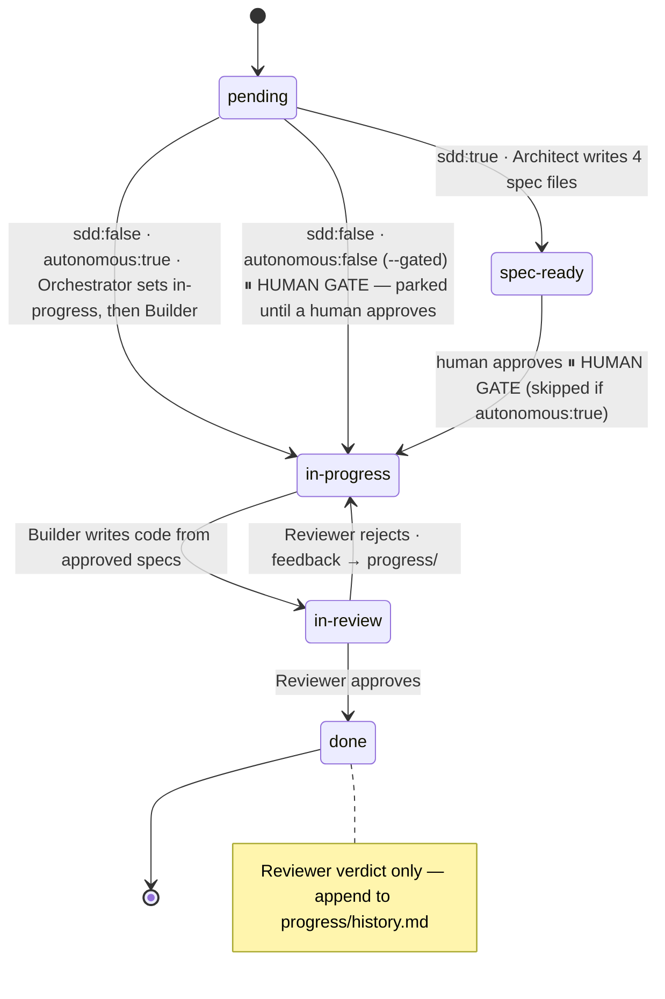

# The Workflow

## Intake — the step before `pending` (`/sdd-new`)

Before a feature is `pending`, a raw idea has to become a well-formed TaskStore
entry. That is **Inception**'s job (`agents/inception.md`), driven by the `/sdd-new`
slash command. A human runs `/sdd-new "<idea>"`, answers a short adaptive Q&A, and
Inception seeds the state machine below:

Inception **seeds; it never specs** — it writes only a `pending` entry plus the
intent brief, never the four spec files, and never advances status past `pending`.
From there `/sdd-next` (the Orchestrator) drives the flow below, including the human
gate. Inception does not spawn the Architect — but the brief is not inert: when the
Orchestrator spawns the Architect for that feature, it passes
`progress/inbox/<feature-id>.md` as a primary input, and the Architect reads it
first and specs from it. That read is what wires the captured intent into spec
generation.

## Whole-project inception (`/sdd-plan`)

Where `/sdd-new` triages **one idea**, `/sdd-plan` captures the **whole project** up
front. It is the **Planner** (`agents/planner.md`), a producer that sits **upstream** of
both the per-epic `/sdd-drill` (F03) and the `/sdd-next` loop. A human runs
`/sdd-plan "<idea>"`, answers a short adaptive Q&A, and the Planner writes the durable
design artifacts — `specs/vision.md`, `specs/architecture.md` + ADRs at
`specs/adr/NNNN-*.md` — and seeds a block of `draft` epics (`state/tasks.json` rows with
`features: []` + a one-paragraph `epic.md` each).

The Planner is a **producer that never specs**: it writes no feature
`.spec/.plan/.tasks/.tests`, never spawns the Architect, and **never advances an epic
past `draft`**. Seeded `draft` epics are inert — the F01 `next()` gate already keeps the
Orchestrator from selecting their features. The flow reads `/sdd-plan` (sketch the
roadmap) → `/sdd-drill <epic-id>` (deepen one epic, flip `draft → planned`) → `/sdd-next`
(execute). It is purely additive: a repo that never runs `/sdd-plan` behaves exactly as
before.

## Per-epic drill-down (`/sdd-drill`)

Where `/sdd-plan` sketches the **whole roadmap** as `draft` epics, `/sdd-drill` deepens
**one** of them. It is the **Driller** (`agents/driller.md`), a consumer that sits between
`/sdd-plan` and the `/sdd-next` loop. A human runs `/sdd-drill <epic-id>` on a single
`draft` epic; the Driller decomposes it into a list of `pending` feature entries (ids,
one-line intents, `depends_on`), fills the epic's `epic.md` feature table, writes a
per-feature inbox brief, and appends any per-epic **ADR deltas** the decomposition forces.

The drill ends in **exactly one** human decision at the epic granularity:

- **approve** → flip the epic `draft → planned` and stamp `autonomous: true` on every
  seeded feature, so the loop runs end-to-end with no per-feature gate;
- **keep gated** → flip the epic `draft → planned` while leaving every feature
  `autonomous: false`, so each parks at the normal per-feature spec-approval gate.

`/sdd-drill` is the **only step that flips an epic `draft → planned`** (the Planner never
advances past `draft`). It **decomposes, never specs** — it **never writes feature specs**
(no feature `.spec/.plan/.tasks/.tests`) and never spawns the Architect; the Architect
specs each feature just-in-time during the run. The flow reads `/sdd-plan` (sketch) →
`/sdd-drill <epic-id>` (deepen one epic) → `/sdd-next` (execute). It is purely additive: a
repo that never runs `/sdd-drill` behaves exactly as before.

## Architecture-aligned specs (the Architect cites ADRs)

The planning tier produces durable design artifacts; this contract makes them
**consumed**. `/sdd-plan` (the Planner) writes `specs/architecture.md` + the ADRs at
`specs/adr/NNNN-*.md`, and `/sdd-drill` (the Driller) records, in each feature's inbox
brief, the `ADR-NNNN` ids that feature is expected to honor. The **Architect**
(`agents/architect.md`) closes the loop: when those artifacts are present it reads
`specs/architecture.md` + the ADRs as a **mandatory input** alongside the brief, and every
feature `.spec.md` it writes carries a **`## Architecture alignment`** section citing the
`ADR-NNNN` ids the feature touches (seeded from the brief's recorded ids — the F03-D7
hook), each with a one-line "how this honors it".

- When architecture artifacts exist but the feature touches **no** recorded decision, the
  section records the explicit **`ADRs touched: none`** (a legitimate state, not a silent
  omission). A divergence is **stated in the section** (which ADR, how, why); the Architect
  never authors an ADR delta — that stays the Driller's job.
- **Graceful degradation:** in a repo that never ran `/sdd-plan` (or `/sdd-new`'s
  altitude-3 flow) the architecture is **absent** (a bare/template-stub file counts as
  absent), so the section is **not required** — the Architect records the absence and
  proceeds from the brief, fabricating no citation and never failing. Specs written before
  this contract stay valid (no retro-fit).
- The **Reviewer** confirms the section is present (citing ≥1 ADR or stating
  `ADRs touched: none`) **only where** architecture artifacts exist **and** the spec is
  `sdd: true`; a missing section there is a **soft flag** (not a hard reject), and the
  check never fires for a legacy/no-architecture feature or an `sdd: false` brief-only
  item.

This places the citation contract **between** `/sdd-plan`/`/sdd-drill` (the producers) and
the Builder/Reviewer (the consumers) — it is additive and distinct from the `/sdd-plan`,
`/sdd-drill`, and `/sdd-fix` lanes.

## Drift check on epic rollup

Rolling-wave planning has a failure mode: a plan sketched early goes **stale** as you learn.
When an epic completes, the new ADRs and architecture deltas its implementation produced can
invalidate the briefs behind the epics still waiting in `draft`/`planned`/`pending`. The drift
check closes that loop, and it is **distinct from** the `/sdd-plan`, `/sdd-drill`,
architecture-alignment, and `/sdd-fix` lanes above.

- **When it fires:** **only** when an epic **rolls up to `done`** (all its features are `done`,
  so the Orchestrator derives+persists the epic's `done`). It does not run on every loop or on a
  feature `done` that does not complete its epic.
- **Scout flags.** The Orchestrator spawns the **read-only Scout** in a drift-check mode to
  re-validate the remaining `draft`/`planned`/`pending` epics against the just-completed epic's
  artifacts. The Scout writes a per-epic still-valid/stale findings file to `progress/` and makes
  **no** state change.
- **Orchestrator demotes.** The **Orchestrator** (not the Scout) demotes a stale
  `planned`/`pending` epic to **`draft`** and re-validates. A stale `draft` epic stays `draft`
  but is flagged; an `in-progress`/`done` epic is **never** demoted.
- **Backward only + manual re-drill.** Demotion only ever moves an epic **backward**
  (`planned`/`pending` → `draft`) — it never advances one. Bringing a demoted epic back to
  `planned` stays a **manual** `/sdd-drill <epic>` step; the Orchestrator reports that re-drill
  pointer on every demotion.
- **No-op, never silent.** With no remaining planning-tier epics, or no architecture to
  re-validate against, the check emits a clear "nothing to re-validate" note and changes nothing.

## Epic lifecycle

Epics have their own, simpler lifecycle: `draft → planned → in-progress → done`.

- **`draft`** — an inception sketch: title + business brief only, not yet drilled
  down. The Orchestrator **never selects work from a `draft` epic** — its features
  are not actionable, no matter what the feature itself says (`autonomous: true`
  skips the human approval gate, not this planning gate).
- **`planned`** — drilled down and human-approved; its features follow the feature
  state machine below, exactly as features of a `pending` epic do.
- Epic-level **`pending` is a legacy alias of `planned`** — gating-equivalent and
  kept indefinitely for backward compatibility. New docs use `planned`.

## State machine

A feature moves through these states. The Orchestrator routes on the current state;
the human gate sits between `spec-ready` and `in-progress`.

## The human-in-the-loop gate

When `harness.config.yaml` has `require_spec_approval: true` (default), the
Orchestrator **pauses** at `spec-ready`. A human:

1. Reads the four spec files for the feature.
2. Requests changes if needed (the Architect revises; stays `spec-ready`).
3. Moves the feature to `in-progress` to authorize coding.

A task with `autonomous: true` in its frontmatter / TaskStore entry skips this gate
— use it only for low-risk work. The point of the gate is that you keep ownership
of *what the AI is building* before hours of code get written on a wrong premise.

## Selective SDD (the `sdd` flag)

Full SDD for a one-line tweak is overkill. Each task carries `sdd: true|false`:

- `sdd: true` → full flow: Architect → gate → Builder → Reviewer.
- `sdd: false` + `autonomous: true` → the Orchestrator **sets the feature to
  `in-progress`** (so the Builder's Loop A precondition holds), then sends the Builder
  straight at it, then Reviewer. No human pause.
- `sdd: false` + `autonomous: false` (e.g. `/sdd-fix --gated`) → **parked at the human
  gate**: the Orchestrator does **not** auto-run it. A human must approve it (move it to
  `in-progress`, or re-stamp `autonomous: true`) before the Builder runs.

### Lightweight fix lane (`/sdd-fix`)

For a one-line bug or hotfix, even seeding a full feature is overkill. `/sdd-fix
"<desc>"` (the **Fixer**, `agents/fixer.md`) is a thin front-end over the `sdd: false`
primitive: it seeds the fix as an `sdd: false` feature under a single **reserved
maintenance epic** (`E99`, `status: planned`, created on first use and reused by id
thereafter), carrying only a one-paragraph **inbox brief** at `progress/inbox/<id>.md` —
**no 4-file spec**, no drill. The fix is stamped `autonomous: true` by default, then handed
off **in-session** to the existing `sdd: false → Builder → Reviewer` path: the Orchestrator
sets it `in-progress` and the Builder runs it end-to-end. A `--gated` opt-out instead stamps
`autonomous: false`, which **parks the fix at the human gate** — the Orchestrator does not
auto-run it, so it waits until a human moves it to `in-progress` (or re-stamps it
`autonomous: true`). The lane **adds no new status and no new routing** — it reuses the
`sdd: false` primitive above (now split by `autonomous`); the Builder works from the inbox
brief and the Reviewer verifies the fix behaviourally.

## Context hygiene

Agents degrade as their context fills (noticeably past ~20%, badly past ~40%).
So:

- Each sub-agent runs with a **fresh, minimal context** — only the files it needs.
- Results go to `progress/<run>/` so the next agent resumes from files, not chat.
- When an agent nears `context_reset_threshold`, it should write a structured
  hand-off to `progress/` and let a fresh agent continue ("context reset").
- `progress/history.md` is the durable changelog across the whole project.

## One run, end to end (example)

1. `./init.sh` → green.
2. Orchestrator reads TaskStore → `E01-F01 example-feature` is `pending`, `sdd:true`.
3. Orchestrator spawns the Architect, passing `progress/inbox/E01-F01.md` (the
   Inception brief); the Architect reads it first and writes the 4 files from it →
   `spec-ready`. **Pause.**
4. Human reads specs, approves → `in-progress`.
5. Builder implements `tasks.md`, writes tests from `tests.md`, self-checks → `in-review`.
6. Reviewer runs tests + Playwright, verifies every R-id. On **reject** it writes
   file-based feedback to `progress/<run>/review.md` → `in-progress` → Builder
   addresses → re-review; this build↔review loop repeats until green. On **approve**
   → `done`. Each round is recorded in `progress/history.md`.
7. History updated. Orchestrator picks the next task.
